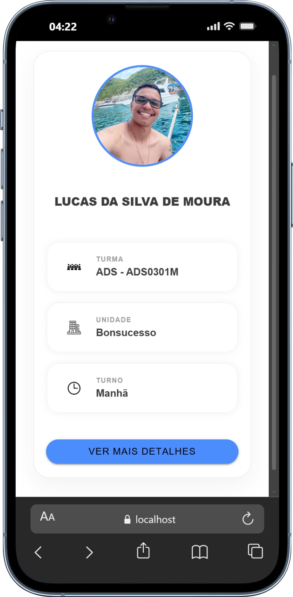
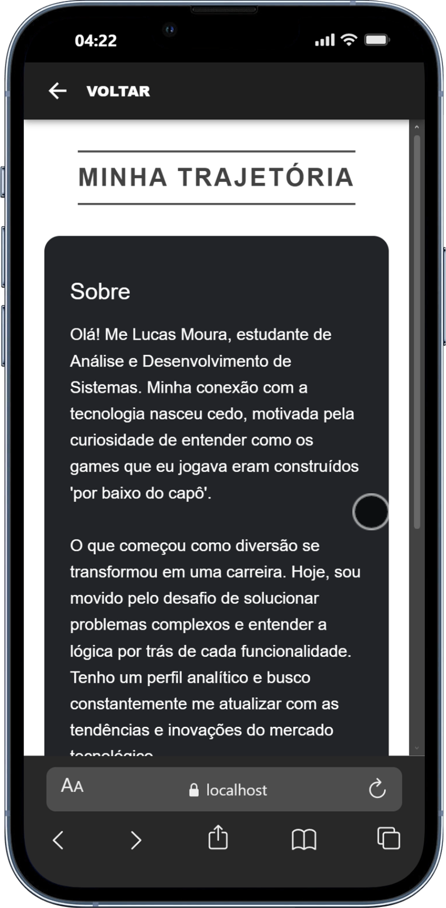

#  Cartão de Identificação Digital - Ionic

Projeto desenvolvido para a atividade de recepção de calouros, simulando um cartão de identificação híbrido (web/mobile) para apresentação pessoal e trajetória acadêmica.

##  Telas

Abaixo, a visualização das interfaces desenvolvidas para o projeto:






##  Funcionalidades

* **Tela de apresentação pessoal (Home):** Identificação visual e dados do curso.
* **Tela de trajetória profissional (Sobre):** Detalhes sobre formação técnica e acadêmica.
* **Navegação com Roteamento:** Transição fluida entre as páginas.
* **Layout Responsivo:** Interface adaptada para navegação em navegadores de smartphones.

##  Tecnologias utilizadas

* **Ionic Framework** (Mobile UI Toolkit)
* **Angular** (Lógica e Estrutura)
* **TypeScript** (Linguagem de Programação)
* **SCSS** (Estilização customizada)
* **Ionicons** (Biblioteca de ícones)

##  Como rodar o projeto
```bash
# Clone o repositório
git clone https://github.com/devlucasmoura/cartao-de-identificacao-ionic.git

# Acesse a pasta
cd cartao-de-identificacao-ionic

# Instale as dependências
npm install

# Rode no navegador
ionic serve
```
## Estrutura de pastas

```text
src/
└── app/
    ├── app-routing.module.ts 
    ├── app.component.html    
    └── pages/
        ├── home/             
        └── sobre/            
```
## Autor

**Lucas da Silva de Moura**  
Estudante de Análise e Desenvolvimento de Sistemas
